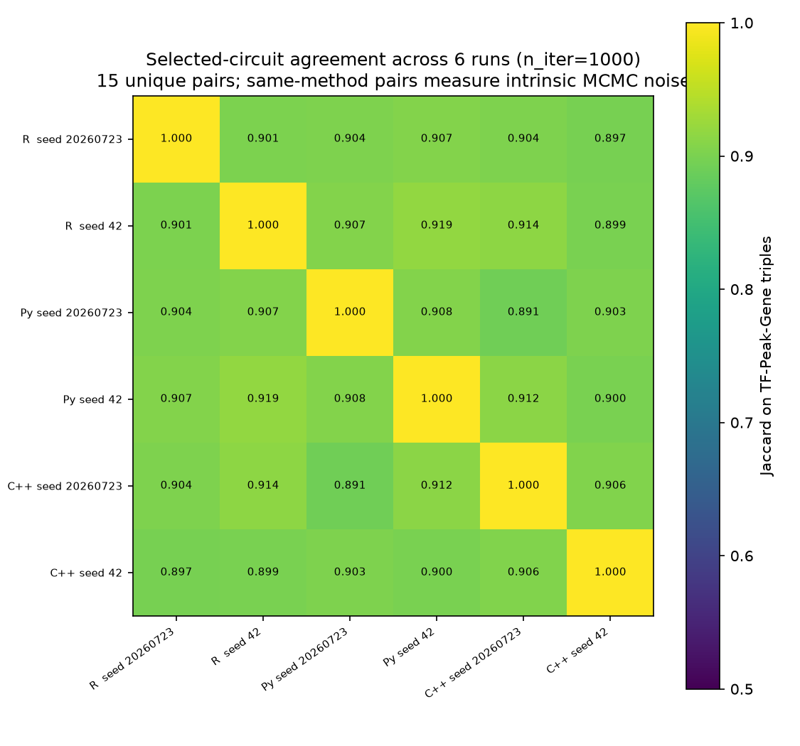
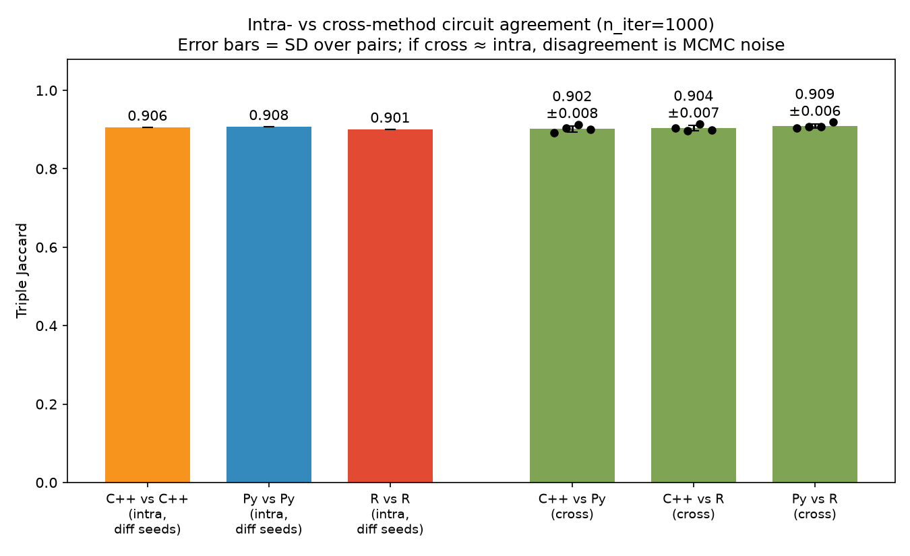
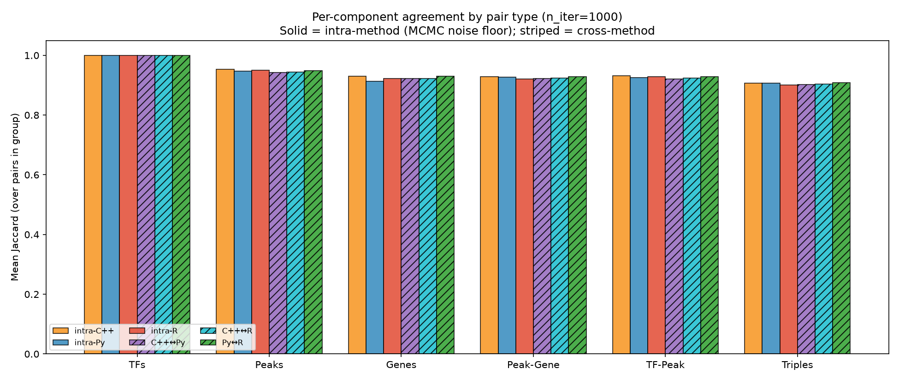
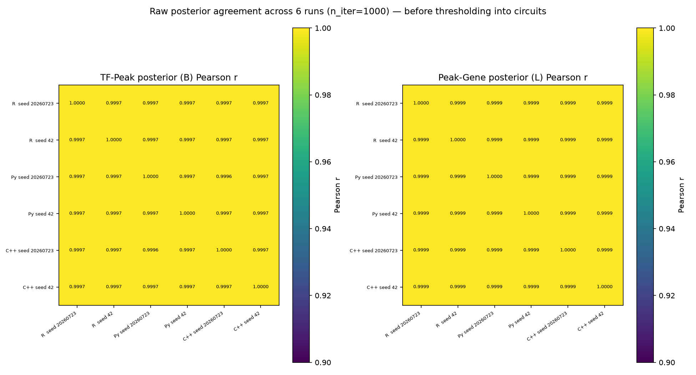
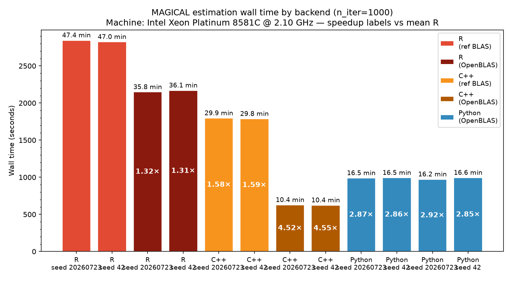
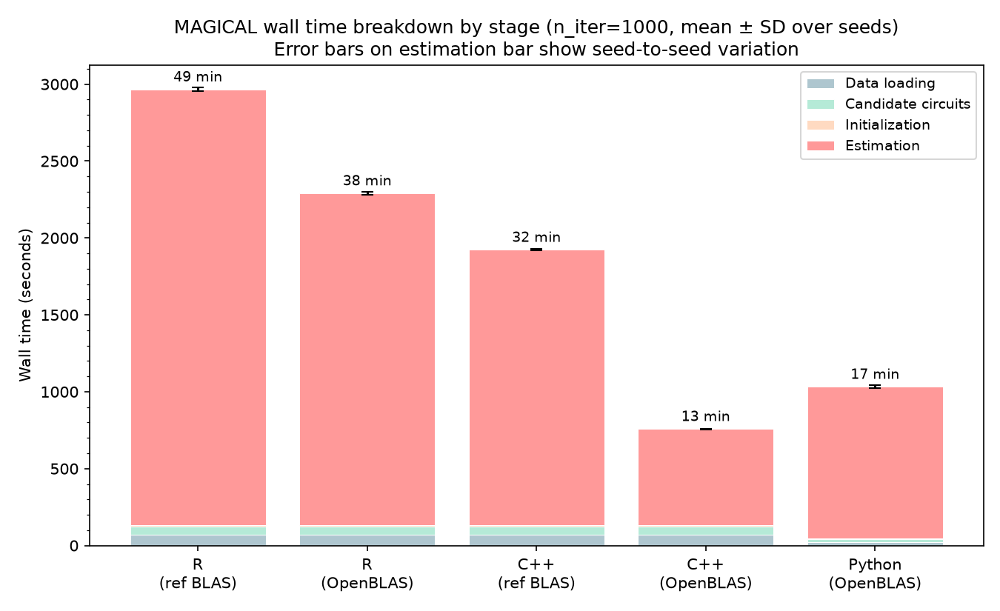

# Performance targets

Baseline established by running `tutorial.R` with the shipped demo dataset at
`iteration_num = 1000`, single chain, R backend (original code, unmodified).

## Baseline: original R implementation

| Machine | Date       | Iterations | user (s)  | system (s) | elapsed (s) | elapsed (min) |
|---------|------------|-----------:|----------:|-----------:|------------:|--------------:|
| M-series MacBook (alan.denadel) | 2026-07-22 |       1000 |  1702.927 |    161.600 |    1870.942 |         31.18 |

Reproduction:
```
Rscript tutorial.R
```
The `proc.time()` timing block is around lines 45–50 of `tutorial.R`.

## Python numpy port vs R original (stage P1 complete, 2026-07-23)

Same machine, same demo dataset, `iteration_num = 1000`, single chain, two seeds
each. R uses [`re-implementation/scripts/gen_demo_parity_snapshots.R`](re-implementation/scripts/gen_demo_parity_snapshots.R);
Python uses [`re-implementation/scripts/save_py_snapshots.py`](re-implementation/scripts/save_py_snapshots.py).

| Backend | Seed       | Estimation (s) | End-to-end (s) | End-to-end (mm:ss) |
|---------|-----------:|---------------:|---------------:|-------------------:|
| R       | 20260723   |        1874.80 |        1944    |             32:24  |
| R       | 42         |        1893.40 |        1962    |             32:42  |
| Py numpy| 20260723   |         621.30 |         648.90 |             10:49  |
| Py numpy| 42         |         617.19 |         644.75 |             10:45  |

**Speedup (mean of the two seeds):**

|                              | R    | Python | Speedup |
|------------------------------|-----:|-------:|--------:|
| Estimation only              | 1884.1 s | 619.2 s | **3.04×** |
| End-to-end (load + circuits + init + estimation) | 1953 s | 646.8 s | **3.02×** |

Both implementations are single-threaded (≈100 % of one core). The end-to-end
gap tracks the estimation gap almost exactly — data-loading, candidate-circuit
construction and initialization together account for <5 % of R's runtime and
run in ~28 s in Python (a mix of faster and slightly slower per-stage than R,
but negligible next to the sampler loop).

### Statistical equivalence at n_iter = 1000 (macOS, R vs Python, 2026-07-23)

All 4-choose-2 pairwise comparisons across the 4 runs above. Circuit-Jaccard
uses the paper's selection thresholds (B ≥ 0.8, L ≥ 0.95). B / L posterior
correlations are Pearson r over the full matrices.

|                     | R@20260723 | R@42  | Py@20260723 | Py@42 |
|---------------------|:----------:|:-----:|:-----------:|:-----:|
| **R@20260723**      | 1.000      | 0.901 | 0.904       | 0.907 |
| **R@42**            | 0.901      | 1.000 | 0.907       | **0.919** |
| **Py@20260723**     | 0.904      | 0.907 | 1.000       | 0.908 |
| **Py@42**           | 0.907      | 0.919 | 0.908       | 1.000 |

| Comparison                | Triple Jaccard | B posterior r | L posterior r |
|---------------------------|:--------------:|:-------------:|:-------------:|
| R ↔ R  (intra, MCMC noise)  | 0.9012 | 0.99966 | 0.99988 |
| Py ↔ Py (intra, MCMC noise) | 0.9076 | 0.99966 | 0.99990 |
| R ↔ Py (cross, mean of 4)   | **0.9090** | 0.99966 | 0.99990 |

**Δ = cross − mean(intra) = +0.005.** Cross-language agreement is
indistinguishable from intra-language MCMC sampler variance; the single highest
Jaccard in the matrix (0.919) is a cross-language pair (R@42 ↔ Py@42). TF sets
are identical in every pair (Jaccard = 1.000).

Reproduce with [`re-implementation/scripts/plot_variability.py`](re-implementation/scripts/plot_variability.py);
plots are in [`benchmarks/plots/variability_*.png`](re-implementation/benchmarks/plots/) and
per-pair metrics in [`benchmarks/variability_metrics.tsv`](re-implementation/benchmarks/variability_metrics.tsv).

## Statistical equivalence at n_iter = 1000 (Linux, R + Python + C++, 2026-07-24)

All 6 runs from the Linux benchmark (R×2, Py×2, C++×2 seeds). Computed with
[`plot_variability.py`](re-implementation/scripts/plot_variability.py) on the
509-TF / 362-peak / 315-gene intersection.

### 6×6 triple-Jaccard matrix

| | R@s1 | R@s2 | Py@s1 | Py@s2 | C++@s1 | C++@s2 |
|---|:---:|:---:|:---:|:---:|:---:|:---:|
| **R@s1** | 1.000 | 0.901 | 0.904 | 0.907 | 0.904 | 0.898 |
| **R@s2** | 0.901 | 1.000 | 0.907 | **0.919** | 0.914 | 0.899 |
| **Py@s1** | 0.904 | 0.907 | 1.000 | 0.908 | 0.891 | 0.903 |
| **Py@s2** | 0.907 | **0.919** | 0.908 | 1.000 | 0.912 | 0.900 |
| **C++@s1** | 0.904 | 0.914 | 0.891 | 0.912 | 1.000 | 0.906 |
| **C++@s2** | 0.898 | 0.899 | 0.903 | 0.900 | 0.906 | 1.000 |

_(s1 = seed 20260723, s2 = seed 42)_

### Summary by pair type

| Pair type | Mean triple Jaccard | Mean B Pearson r | Mean L Pearson r |
|---|:---:|:---:|:---:|
| R ↔ R   (intra, MCMC noise)   | 0.9012 | 0.99966 | 0.99988 |
| Py ↔ Py (intra, MCMC noise)   | 0.9076 | 0.99966 | 0.99990 |
| C++ ↔ C++ (intra, MCMC noise) | 0.9062 | 0.99965 | 0.99992 |
| R ↔ Py  (cross)               | 0.9090 | 0.99965 | 0.99990 |
| R ↔ C++ (cross)               | 0.9038 | 0.99965 | 0.99991 |
| Py ↔ C++ (cross)              | 0.9016 | 0.99965 | 0.99991 |

All three cross-language means fall within the scatter of the three intra-language
pairs. **C++ output is statistically indistinguishable from R and Python** — all
disagreement is intrinsic MCMC sampler variance, not an implementation difference.









## Target for the Rcpp/Armadillo re-implementation

The re-implementation lives under `re-implementation/` and must **beat 619 s
elapsed** (Python numpy port, estimation only, mean of 2 seeds) on the same
machine, same demo dataset, same `iteration_num = 1000`, using
`MAGICAL_estimation(..., backend = "cpp")`. The soft target relative to the
original R baseline is unchanged: ≥ 10× on estimation.

**Note (2026-07-24)**: on Linux with R's default reference BLAS, C++ runs at
1.58× vs R — the target is not yet met with ref BLAS. **Update (2026-07-25)**:
with conda OpenBLAS, C++ achieves **624 s** (mean of 2 seeds) — beating the
619 s target and running **1.57× faster than Python**. The ≥10× goal vs R
requires the standalone C++ path (no R overhead); see TODO.md.

## Linux benchmark — all three backends, conda OpenBLAS (2026-07-25)

Same machine, same dataset, `iteration_num = 1000`. R and C++ run via the
`magical-r` conda environment (`libblas=*=*openblas`, OpenBLAS 0.3.33 pthreads).
Python is unchanged (scipy-openblas DYNAMIC_ARCH, Haswell codepath).

### Estimation wall time

| Backend | BLAS | Seed | Estimation (s) | Total (s) |
|---|---|---:|---:|---:|
| R (conda OpenBLAS) | libopenblasp-r0.3.33 | 20260723 | 2146.8 | 2279.2 |
| R (conda OpenBLAS) | libopenblasp-r0.3.33 | 42 | 2168.7 | 2301.9 |
| C++ / Rcpp (conda OpenBLAS) | libopenblasp-r0.3.33 | 20260723 | 626.1 | 760.3 |
| C++ / Rcpp (conda OpenBLAS) | libopenblasp-r0.3.33 | 42 | 622.0 | 755.6 |
| Python numpy (OpenBLAS Haswell) | scipy-openblas | 20260723 | 971.3 | 1016.9 |
| Python numpy (OpenBLAS Haswell) | scipy-openblas | 42 | 993.0 | 1038.6 |

### Speedup summary (estimation only, mean of 2 seeds)

| Backend | BLAS | Mean estimation | vs R ref-BLAS | vs Python (Linux) |
|---|---|---:|---:|---:|
| R | ref BLAS | 2833 s | 1.00× | — |
| C++ / Rcpp | ref BLAS | 1790 s | 1.58× | — |
| Python numpy | scipy-openblas Haswell | **982 s** | 2.88× | 1.00× |
| R | conda OpenBLAS | 2158 s | **1.31×** | — |
| **C++ / Rcpp** | **conda OpenBLAS** | **624 s** | **4.54×** | **1.57×** |

Key findings:
- **C++ OpenBLAS beats Python by 1.57×** and beats the 619 s target ✅
- **C++ improves 2.87× over ref BLAS** — Armadillo makes large, regular DGEMM
  calls that vectorize well
- **R improves only 1.31×** — R interpreter overhead and dplyr wrangling per
  iteration are the dominant cost at this matrix size; BLAS is secondary
- **`OPENBLAS_CORETYPE=SKYLAKEX` has no effect on scipy-openblas64** — the
  env var is ignored by the bundled private build

Reproduce:
```bash
bash re-implementation/scripts/bench_all_openblas.sh
```

## Linux benchmark — all three backends (2026-07-24)

Machine: **Intel Xeon Platinum 8581C @ 2.10 GHz**, 224 logical CPUs (2-socket),
Ubuntu 22.04 LTS. Single chain, `iteration_num = 1000`, demo dataset.

BLAS situation:
- R and C++ (Rcpp): R's default **reference BLAS** (`libRblas`, scalar, no SIMD)
- Python numpy: **scipy-openblas** 0.3.33 — `DYNAMIC_ARCH`, detected as **Haswell**
  (AVX2). The actual CPU likely supports AVX-512 but OpenBLAS fell back to
  the Haswell codepath. See TODO.md for the Haswell detection issue.

### Estimation wall time

| Backend | BLAS | Seed | Estimation (s) | Total (s) |
|---|---|---:|---:|---:|
| R (ref BLAS) | libRblas | 20260723 | 2843.7 | 2975.4 |
| R (ref BLAS) | libRblas | 42 | 2822.2 | 2957.4 |
| C++ / Rcpp (ref BLAS) | libRblas | 20260723 | 1794.8 | 1925.3 |
| C++ / Rcpp (ref BLAS) | libRblas | 42 | 1785.9 | 1920.4 |
| Python numpy (OpenBLAS Haswell) | scipy-openblas | 20260723 | 988.1 | 1034.4 |
| Python numpy (OpenBLAS Haswell) | scipy-openblas | 42 | 991.9 | 1038.5 |

### Speedup vs R (estimation only, mean of 2 seeds)

| | Linux (ref BLAS / OpenBLAS Haswell) | macOS (ref BLAS / Accelerate) |
|---|---:|---:|
| C++ / Rcpp | **1.58×** | 1.56× |
| Python numpy | **2.86×** | 3.04× |

Reproduce:
```bash
bash re-implementation/scripts/bench_all.sh
uv run python re-implementation/scripts/plot_benchmarks.py
```





## Future benchmark entries

Add rows to the tables above as conditions change. Include:
- machine, date, OS, BLAS library + version
- commit hash
- any non-default flags (e.g. `OPENBLAS_NUM_THREADS`)
